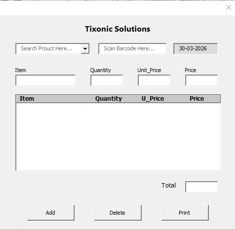
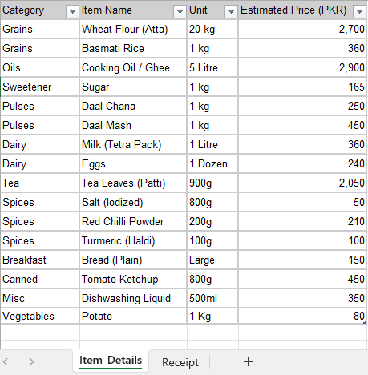

# Shopkeeper-Excel-Receipt-System

## 📖 Description
This project is an automated receipt generation system built using Microsoft Excel (VBA enabled).

It helps shopkeepers manage products and generate customer receipts efficiently using barcode scanning or manual selection.

## 🚀 Features
- Add and manage items (category (optional), item name, unit_quantity, price)
- Barcode scanner support (optional)
- Manual product selection using ComboBox
- Auto display of product details (item name & price)
- Automatic total price calculation
- Dynamic receipt generation
- Printable receipt format
- Centralized item database

## 🧠 How It Works
1. Shopkeeper adds all product details in the Excel sheet  
2. When a customer arrives:
   - Scan barcode OR select item from dropdown  
3. System automatically:
   - Fetches product details  
   - Calculates total price  
   - Adds item to receipt  
4. Receipt is generated and printed  

## 📂 Project Structure
- Shopkeeper Receipt System (.xlsm) → Main system with VBA

## ⚙️ Requirements
- Microsoft Excel (2016 or later)
- Enable Macros before using
- Barcode Scanner (optional)
  
## 🖼️ Screenshots
Receipt Form

Item_Details

## 🔧 Technologies Used
- Microsoft Excel
- VBA (Visual Basic for Applications)
- Form Controls (ComboBox, Buttons)

## 📌 Future Improvements
- Automatic stock update after sale
- Sales dashboard and analytics
- Database integration (Python / SQL)
- Cloud-based system
  
## 👤 Author
***Danyal Asif**
